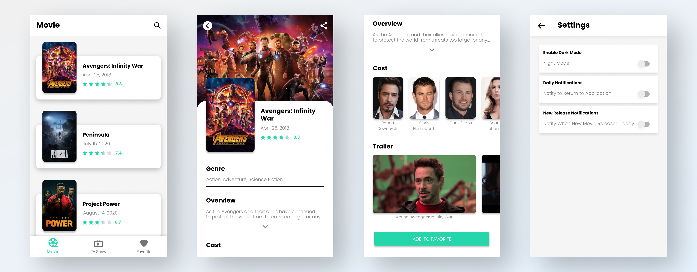

# My-Movie-Db

Some facts about this project:

- Completely written in Kotlin
- Using MVVM Design Pattern
- Using Android ViewModels
- Using Room Persistence Library
- Using [Retrofit](https://square.github.io/retrofit/) and [OkHttp](https://square.github.io/okhttp/) Library for networking
- Using [The Movie Database (TMDB) API](https://www.themoviedb.org/documentation/api)

## Preview App

## Features

The My Movie Db app lets you:
- Search for movies & tv shows
- Displays a list of movies & tv shows
- Displays a list of favorite movies & tv shows
- Displays the release date, rating, genre, overview, cast, and trailer of the film or TV show
- Add and remove movies or tv shows from favorites list
- Share the TMDB link of movies or TV shows via other apps
- Daily reminder notifications to return to the app
- Reminder notification for movies released today
- Supports dark mode and light mode for app themes

## Requirements

minSdkVersion : 23

## License

Distributed under the MIT License. See `LICENSE` for more information.

## Contact

Mochammad Arya Salsabila - Aryasalsabila789@gmail.com
